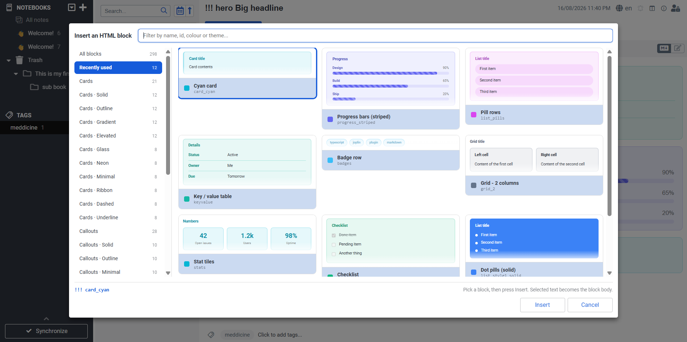
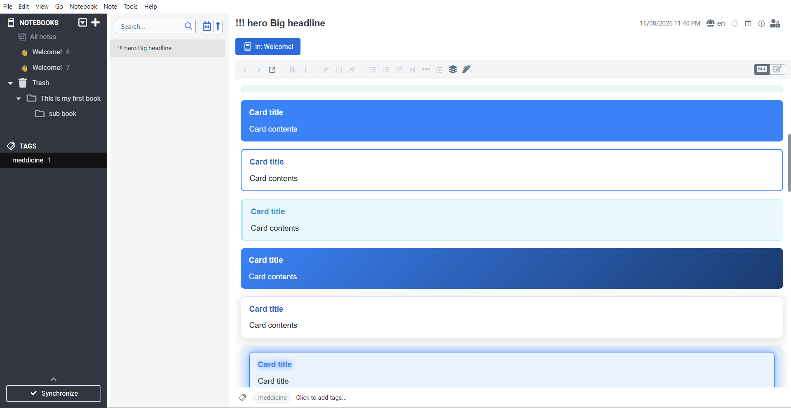
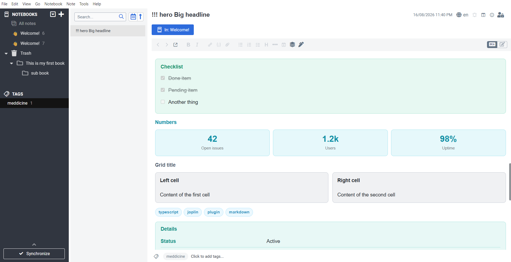

# HTML Blocks - a Joplin plugin

Write styled HTML sections in your notes with a simple markdown fence. No HTML,
no inline CSS.

```
!!! card_light_blue My card title
Card contents, with the usual **markdown** you'd expect.
!!!->
```

...renders as a light blue card in the note viewer, in exported HTML and in PDF
exports. 298 block types are included, in 28 categories: cards in eleven styles,
admonition-style callouts, twenty-two list styles, steps, timelines, stat tiles,
progress bars, ratings, tables, pros and cons, FAQs, feature grids, chat
transcripts, grids, banners, collapsible sections and more.

## Screenshots



*The picker: filter 298 blocks by name, id, colour or theme, and insert one with
a click.*



*Cards in the note viewer - solid, outline, tinted, gradient and elevated.*



*Checklists, stat tiles, badge rows, grids and key/value tables.*

## Installation

Search for **HTML Blocks** in *Tools &rarr; Options &rarr; Plugins*, or install
`com.madusanka.htmlBlocks.jpl` with *Install from file*. Requires Joplin 3.0 or
later on desktop.

## Documentation

[**User manual (PDF)**](docs/HTML-Blocks-Manual.pdf) - 89 pages covering every
block, with a rendered preview beside the markdown for each one. It is generated
by the plugin's own renderer via `npm run manual`, so the previews always match
what Joplin actually draws.

## The syntax

```
!!! <type> <optional title>
<contents>
!!!->
```

* The opening fence is `!!!` followed by a block type. A type always starts with
  a letter, which is what keeps it from being confused with a closing fence.
* Anything after the type on the same line is the block **title**. It is
  optional, and inline markdown works in it.
* The closing fence can be written `!!!->`, `!!!<-`, or just `!!!`.
* Blocks **nest**. A card can contain a callout, which can contain a list.
* An unclosed block runs to the end of the note rather than disappearing, so the
  preview stays useful while you are still typing.
* An unrecognised type still renders (as a plain dashed box with the type shown
  in the corner) instead of silently vanishing.

Most blocks treat their contents as ordinary markdown. The list-like ones
(`list_*`, `steps`, `timeline`, `stats`, `progress`, `rating`, `keyvalue`,
`table`, `pros_cons`, `faq_*`, `features_*`, `chat`, `badges`) treat **one line
as one item** instead, and split fields on `::`:

```
!!! steps How it works
Install it :: Download and run the installer
Configure it :: Open the settings screen
Use it :: You are done
!!!->
```

Grids split their cells on a `---` line:

```
!!! grid_2 Two things
**Left**

Left hand contents
---
**Right**

Right hand contents
!!!->
```

## Inserting blocks

Three ways, whichever suits you:

* **Toolbar button** in the editor, or **Ctrl+Alt+H** - opens the picker. If you
  had text selected, it becomes the body of the new block.
* **Tools → HTML Blocks** - every block, grouped by category.
* **Command palette** - type "Insert block" and the block name.

The picker shows each block as a **live preview** rather than a name: every tile
is the real block, drawn by the same renderer the note viewer uses, so what you
see in the dialog is what lands in the note. It opens on the blocks you reached
for most recently, and the sidebar walks the categories. Typing filters across
every category at once - by name, id, colour, mode or theme - the arrow keys walk
the grid, and a double click inserts straight away.

Previews can be turned off in *Tools → Options → HTML Blocks* if you would rather
have a plain list of names.

**Tools → HTML Blocks → Insert cheat sheet** drops one example of every single
block type into the current note, which is the quickest way to see what they all
look like.

## Block reference

There are too many block types to list one by one here - the picker shows every
one of them as a preview, and the [user manual](docs/HTML-Blocks-Manual.pdf)
pairs each one with its markdown. The categories are:

| Category | Blocks | For example |
|---|---|---|
| Cards | 21 | `card_light_blue`, `card_blue`, `card_indigo` |
| Cards · Solid | 12 | `card_solid_blue`, `card_solid_indigo`, `card_solid_violet` |
| Cards · Outline | 12 | `card_outline_blue`, `card_outline_indigo`, `card_outline_violet` |
| Cards · Gradient | 12 | `card_gradient_blue`, `card_gradient_indigo`, `card_gradient_violet` |
| Cards · Elevated | 12 | `card_elevated_blue`, `card_elevated_indigo`, `card_elevated_violet` |
| Cards · Glass | 8 | `card_glass_blue`, `card_glass_violet`, `card_glass_pink` |
| Cards · Neon | 8 | `card_neon_blue`, `card_neon_violet`, `card_neon_pink` |
| Cards · Minimal | 8 | `card_minimal_blue`, `card_minimal_violet`, `card_minimal_pink` |
| Cards · Ribbon | 8 | `card_ribbon_blue`, `card_ribbon_violet`, `card_ribbon_pink` |
| Cards · Dashed | 8 | `card_dashed_blue`, `card_dashed_violet`, `card_dashed_pink` |
| Cards · Underline | 8 | `card_underline_blue`, `card_underline_violet`, `card_underline_pink` |
| Callouts | 28 | `callout_info`, `callout_tip`, `callout_warning` |
| Callouts · Solid | 10 | `callout_info_solid`, `callout_tip_solid`, `callout_note_solid` |
| Callouts · Outline | 10 | `callout_info_outline`, `callout_tip_outline`, `callout_note_outline` |
| Callouts · Minimal | 10 | `callout_info_minimal`, `callout_tip_minimal`, `callout_note_minimal` |
| Lists | 20 | `list_style1`, `list_pills`, `list_ranked` |
| Lists · Themed | 9 | `list_style1_solid`, `list_style2_solid`, `list_style3_solid` |
| Checklists | 4 | `list_check`, `checklist_outline`, `checklist_boxed` |
| Steps | 5 | `steps`, `steps_solid`, `steps_outline` |
| Timelines | 5 | `timeline`, `timeline_solid`, `timeline_outline` |
| Numbers | 11 | `stats`, `progress`, `rating` |
| Grids & columns | 13 | `grid_2`, `grid_3`, `columns_2` |
| Boxes | 16 | `box_plain`, `box_terminal`, `note_paper` |
| Banners & heroes | 12 | `banner`, `hero`, `section_title` |
| Quotes | 5 | `quote_box`, `quote_pull`, `quote_card` |
| Collapsible | 7 | `details`, `details_open`, `faq_list` |
| Badges & tags | 5 | `badges`, `badges_tags`, `badges_square` |
| Tables & data | 11 | `keyvalue`, `table`, `pros_cons` |

Most ids read the way they look: `<family>_<theme>_<colour>`. The short,
memorable ones are aliased - `info`, `tip`, `warning`, `note`, `quote`,
`collapse`, `spoiler`, `kv`, `tags`, `terminal` and friends all work as types.

**Line formats.** Blocks that take one line per item split their fields on `::`:

| Type | Line format |
|---|---|
| `steps` | `title :: description` |
| `timeline` | `when :: title :: description` |
| `stats` | `value :: label` |
| `progress` | `label :: 70` or `7/10` or `70%` |
| `rating` | `label :: 4` (out of five) or `8/10` |
| `keyvalue` | `key :: value` |
| `table` | `cell :: cell :: cell` - the first line is the header row |
| `pros_cons` | `+ a good thing` / `- a bad thing`, `:: Left :: Right` renames the columns |
| `faq_list` | `question :: answer` |
| `features_2` | `🚀 title :: description` |
| `chat` | `who :: message`, a leading `>` forces the message right |
| `badges` | split on commas and newlines |
| `list_*` | one item per line; `[x]` / `[ ]` for checkboxes, two spaces to nest |
| `grid_*`, `columns_*` | markdown cells split on a `---` line |

## Editor highlighting

In the markdown editor the fences are coloured with the block's own colour, the
lines inside get a tinted background and a coloured left bar, and nested blocks
are indented. An unknown block type is underlined in red so typos are obvious
before you switch to the viewer.

Turn it off in **Tools → Options → HTML Blocks** if you'd rather not have it.

## Theming

Every block derives all of its colours from one base colour, mixed against the
current Joplin theme with `color-mix()`. That means the blocks follow your theme
automatically - no separate dark mode stylesheet, and no hard-coded white
backgrounds glaring at you in dark mode. On renderers without `color-mix()`
support the blocks fall back to plain outlines.

To restyle a block yourself, target it in your userstyle:

```css
/* every block carries its type in a data attribute */
.jhtml[data-jhtml-type="card_light_blue"] { --jh-color: #ff00aa; }
```

## Adding your own block types

`tools/block-families.js` is the source of truth. It describes blocks by family -
a family being one shape crossed with a set of colours and themes - and
`npm run blocks` expands it into `src/blocks/blocks.json`, which is what ships.
Edit the families, never the JSON: the JSON is regenerated (and your edits lost)
on the next build.

```js
{ id: 'card_brown', label: 'Brown card', category: 'Cards', mode: 'card',
	color: 'brown', titleHint: 'Card title', bodyHint: 'Card contents' },
```

...then `npm run dist`. The new type is immediately available in the parser, the
viewer stylesheet, the editor highlighter, the menus and the picker dialog -
there is nowhere else to register it. The generator refuses to write a registry
with a duplicate id or alias, an unknown mode or a missing colour, so a mistake
in a family fails the build rather than shipping.

A block is a **mode** (which renderer draws it) plus a **theme** (what the chrome
around it looks like). The two are independent - any theme works on any mode:

* `mode`: `card`, `callout`, `plain`, `quote`, `details`, `grid`, `list`,
  `steps`, `timeline`, `stats`, `progress`, `rating`, `badges`, `keyvalue`,
  `table`, `compare`, `faq`, `feature`, `chat`.
* `theme`: `soft` (the default), `solid`, `outline`, `gradient`, `elevated`,
  `glass`, `neon`, `minimal`, `ribbon`, `dashed`, `underline`.

The remaining fields (`icon`, `defaultTitle`, `variant`, `listStyle`, `ordered`,
`columns`, `bare`, `open`, `aliases`) are documented in `src/blocks/types.ts`.

## Building

```sh
npm install
npm run dist
```

That regenerates the stylesheets, compiles everything and writes
`publish/com.madusanka.htmlBlocks.jpl`.

To install the built plugin: **Tools → Options → Plugins → the gear icon →
Install from file**, and pick the `.jpl`.

For development, point **Tools → Options → Plugins → Advanced → Development
plugins** at this folder (`H:\Projects\joplin_html`) and restart Joplin. Joplin
then loads `dist/` directly, so a `npm run dist` plus a restart picks up your
changes.

## Layout

```
src/
  index.ts                  main script: settings, commands, menus, picker dialog
  picker.ts                 builds the picker dialog's HTML
  blocks/
    blocks.json             the registry - generated, every block type lives here
    types.ts                registry types
    syntax.ts               the fence grammar, shared by viewer and editor
    render.ts               all HTML generation, shared by viewer and picker
    preview.ts              the picker's thumbnails, on top of render.ts
    viewerCss.ts            generated - the viewer stylesheet, as a string
    index.ts                lookup helpers and the snippet builder
  markdownItPlugin/         markdown-it content script (the viewer)
  codeMirrorPlugin/         CodeMirror 6 content script (the editor)
  dialog/                   assets for the block picker
tools/
  block-families.js         the block families - the source of truth
  generate-blocks.js        expands the families into blocks.json
  generate-styles.js        builds both stylesheets from the registry
  styles/                   hand written CSS the generator wraps
```

The picker's thumbnails go through `blocks/render.ts`, the same code the note
viewer uses, so a preview cannot drift away from what Joplin actually draws. The
generated viewer stylesheet is inlined into the dialog's HTML (as
`blocks/viewerCss.ts`) for the same reason: Joplin replaces a dialog's content
on every open, so the previews carry their own styling rather than depending on
a second file resolving inside the dialog frame.

`src/blocks/blocks.json`, `src/blocks/viewerCss.ts`,
`src/markdownItPlugin/style.css` and `src/codeMirrorPlugin/style.css` are
generated - edit `tools/block-families.js` and `tools/styles/*.css` instead.
